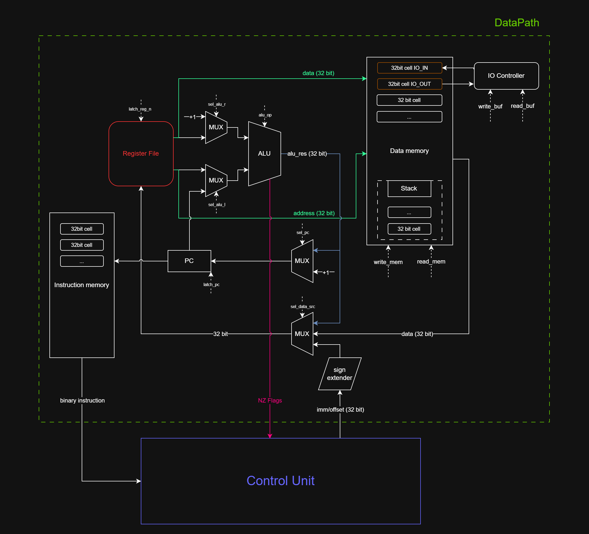

# Архитектура Компьютера. Лабораторная работа 4

Поленов Кирилл Александрович P3213

## Вариант

```asm | risc | harv | mc | tick | binary | stream | mem | pstr | prob2```

## Язык программирования

### Синтаксис

Язык ассемблерного типа для RISC системы команд

```ebnf
<program> ::= <data_section> <code_section>

<data_section> ::= "." "data" { <data_definition> }
            
<code_section> ::= "." "code" { <instruction> | <macro_definition> | <macro_invocation> }

<instruction> ::=
               "lui" <register> "," { <label> | <string> | <number> }
               | "addi" <register> "," <register> "," { <label> | <string> | <number> } [ <comment> ]
               | "ori" <register> "," <register> "," { <label> | <string> | <number> } [ <comment> ]
               | "sw" <register> "," <register> "," { <label> | <number> } [ <comment> ]
               | "lw" <register> "," <register> "," { <label> | <number> } [ <comment> ]
               | "add" <register> "," <register> "," <register> [ <comment> ]
               | "sub" <register> "," <register> "," <register> [ <comment> ]
               | "mul" <register> "," <register> "," <register> [ <comment> ]
               | "mulh" <register> "," <register> "," <register> [ <comment> ]
               | "div" <register> "," <register> "," <register> [ <comment> ]
               | "and" <register> "," <register> "," <register> [ <comment> ]
               | "or" <register> "," <register> "," <register> [ <comment> ]
               | "xor" <register> "," <register> "," <register> [ <comment> ]
               | "jal" <register> "," <label> [ <comment> ]
               | "jalr" <register> "," <register> "," <label> [ <comment> ]
               | "beq" <register> "," <register> "," <label> [ <comment> ]
               | "bne" <register> "," <register> "," <label> [ <comment> ]
               | "bgt" <register> "," <register> "," <label> [ <comment> ]
               | "ble" <register> "," <register> "," <label> [ <comment> ]
               | "halt" [ <comment> ]
               | <label> [ <comment> ]

<macro_definition> ::= "%" "macro" <identifier> [ "(" <macro_parameter_list> ")" ] { <instruction> } "%" "endmacro" [ <comment> ]

<macro_parameter_list> ::= <identifier> { "," <identifier> }

<macro_invocation> ::= <identifier> [ "(" <macro_argument_list> ")" ] [ <comment> ]

<macro_argument_list> ::= <macro_argument> { "," <macro_argument> }

<macro_argument> ::= <label> | <string> | <number> | <register>

<data_definition> ::= <label> <data_value> { "," <data_value> } [ <comment> ]

<data_value> ::= <string> | <number>

<register> ::= "r" <number>

<label> ::= <identifier> ":"

<identifier> ::= <letter> { <letter> | <digit> }

<number> ::= <digit> { <digit> }

<string> ::= "\"" { <character> } "\""

<letter> ::= "a" | "b" | "c" | ... | "z"
           | "A" | "B" | "C" | ... | "Z"

<digit> ::= "0" | "1" | "2" | "3" | "4" | "5" | "6" | "7" | "8" | "9"

<character> ::= <any printable ASCII character except quotation mark>

<comment> ::= ";" { <any printable ASCII character> }
```

### Директивы

- `%hi(literal)` - загрузить верхние 20 бит литерала
- `%lo(literal)` - загрузить нижние 12 бит литерала

```asm
.data
    message: "Hello, world!"

.code
    lui bp, %hi(message)      ; загрузить верхние 20 бит адреса метки message
    ori bp, bp, %lo(message)  ; загрузить нижние 12 бит адреса метки message без расширения знака
```

- `.org <address>` - задать начальный адрес секции
- `.data` - создает секцию памяти данных
- `.code` - создает секцию памяти команд
- `%macro <macros definition> %endmacro` - пара директив задающие пользовательскую макрооперацию

#### Пример макроса

```asm
.data
    message: "Hello, world!"

.code
    %macro load_str_ptr(address)
        lui bp, %hi(address)
        ori bp, bp, %lo(address)
    %endmacro

    %macro load_and_add(rd, rs, offset, value)
        lw rd, rs, offset
        addi rd, rd, value
    %endmacro

    load_str_ptr(message) ; Вызов макроса load_str_ptr с аргументом message

    load_and_add(s1, s2, 0, 5) ; Вызов макроса load_and_add с несколькими аргументами

    halt
```

### Команды

| Команда                     | Описание                                                                                                              |
|-----------------------------|-----------------------------------------------------------------------------------------------------------------------|
| `lui <rd>, <k>`             | Загрузить верхние 20 бит литерала в регистр                                                                           |
| `sw <rs2>, <rs1>, <offset>` | Сохранить слово из rs2 по адресу из rs1 со смещением offset                                                           |
| `lw <rd>, <rs1>, <offset>`  | Загрузить слово в rd c адреса из rs1 со смещением offset                                                              |
| `addi <rd>, <rs1>, <k>`*    | Сложить содержимое регистра rs1 с литералом k<br/> и поместить результат в регистр rd                                 |
| `add <rd>, <rs1>, <rs2>`    | Сложить содержимое регистра rs1 с содержимым регистра rs2<br/> и поместить результат в регистр rd                     |
| `sub <rd>, <rs1>, <rs2>`    | Вычесть содержимое регистра rs1 из содержимого регистра rs2 <br/>и поместить результат в регистр rd                   |
| `mul <rd>, <rs1>, <rs2>`    | Умножить содержимое регистра rs1 на содержимое регистра rs2 <br/>и поместить результат в регистр rd                   |
| `mulh <rd>, <rs1>, <rs2>`   | Умножить содержимое регистра rs1 на содержимое регистра rs2 <br/>и поместить верхние 32 бита результата в регистр rd  |
| `div <rd>, <rs1>, <rs2>`    | Разделить содержимое регистра rs1 на содержимое регистра rs2 <br/>и поместить результат в регистр rd                  |
| `and <rd>, <rs1>, <rs2>`    | Совершить логическое И содержимого регистра rs1 и содержимого регистра rs2<br/> и поместить результат в регистр rd    |
| `or <rd>, <rs1>, <rs2>`     | Совершить логическое ИЛИ содержимого регистра rs1 и содержимого регистра rs2 и поместить результат в регистр rd       |
| `ori <rd>, <rs1>, <k>`      | Совершить логическое ИЛИ содержимого регистра rs1 и литерала k<br/> и поместить результат в регистр rd                |
| `xor <rd>, <rs1>, <rs2>`    | Совершить исключающее ИЛИ содержимого регистра rs1 и содержимого регистра rs2<br/> и поместить результат в регистр rd |
| `jal <rd>, <k>`*1           | Перейти на адрес pc + k, сохранив адрес возврата в регистр rd.<br/> Аналог call и jump                                |
| `jalr <rd>, <rs1>, <k>`*1   | Перейти на адрес из rs1, сохранив адрес возврата в регистр rd.<br/> Аналог call и return                              |
| `beq <rs1>, <rs2>, <k>`     | Остановить процессор                                                                                                  |
| `bne <rs1>, <rs2>, <k>`     | Перейти на адрес pc + k, <br/>если содержимое rs1 равно содержимому rs2                                               |
| `bgt <rs1>, <rs2>, <k>`     | Перейти на адрес pc + k, <br/>если содержимое rs1 не равно содержимому rs2                                            |
| `ble <rs1>, <rs2>, <k>`     | Перейти на адрес pc + k, <br/>если содержимое rs1 больше содержимого rs2. Для сравнения знаковых чисел                |
| `halt`                      | Перейти на адрес pc + k, <br/>если содержимое rs1 меньше или равно содержимому rs2. Для сравнения беззнаковых чисел   |

\* - addi расширяет знак литерала k

\*1 - Если подать регистр `r0` как аргумент `<rd>`, адрес возврата не будет сохранен.

### Стратегия вычислений

- Ассемблер соответствует строгой модели вычислений. Все аргументы вычисляются до применения к ним функций
- В выражениях, состоящих из нескольких операций, приоритет выполнения операций определяет программист

### Области видимости

В языке не существует как таковых областей видимости, однако есть пара моментов:

- Секция данных и команд не имеют прямого доступа друг к другу
- На аппаратном уровне невозможно прочитать команду из памяти команд как данные и наоборот

### Типизация. Виды литералов

- Язык является [**беcтиповым**](https://habr.com/ru/articles/161205/). Все сущности считаются последовательностью бит
  различной длины в пределах машинного слова
- Регистры являются универсальными контейнерами для хранения переменных в виде битовых последовательностей
- Интерпретация содержимого регистров зависит от инструкций, которые к ним применяются. К примеру инструкция `add`
  подразумевает, что операндами являются числа. Инструкция `lw` подразумевает, что один регистров-операндов содержит
  адрес в памяти
- Отсутствие статической проверки типов
- Отсутствие неявных преобразований

Однако в контексте ассемблера битовые последовательности можно разделить на следующие категории:

- Знаковые числа
- Адреса
- Символы
- Строки (последовательности символов)

Литералы соответствуют одной из категорий перечисленных выше

## Организация памяти

- Размер машинного слова - **32 бита**
- Модель памяти соответствует Гарвардской архитектуре
- Присутствует 3 вида памяти: Память инструкций, Память данных, Память микрокоманд
- Адреса памяти данных и памяти команд представляют собой беззнаковые 32 битные числа
- Обращение к памяти происходит только по абсолютному адресу
- Память команд является read-only на аппаратном уровне
- Память Команд
  - Инструкции имеют фиксированную длину - 32 бита
  - Инструкции хранятся в ячейках размером 32 бита
- Память Данных
  - Данные хранятся в ячейках размером 32 бита
- Обращение к памяти происходит только через регистры
- `ALU` не имеет прямого доступа к памяти
- Модель включает в себя 32 регистра
- За управление регистрами отвечает `Register File`
- Регистр `r0` - `Zero register` (значение всегда равно 0)
- Регистр `r31` - системный для временного хранения `imm/offset` значений
- Стек не является аппаратной частью и располагается в конце памяти команд.
  Для аргументов и возвращаемых значений функций следует использовать регистры
  согласно [соглашению](#описание-регистров-и-их-назначение)
- По умолчанию все переменные отображаются в память данных в порядке их инициализации в секции `.data`
- Переменные могут быть отображены на регистры только при явной загрузке в регистры
- Порядок расположения литералов в памяти данных соответствует порядку их объявления в секции `.data`
- Литералы превышающие 32 бита хранятся в памяти следующим образом:

```text
        Data Memory
+-----------------------------+
|      ...                    |
| n       lit_low             |
| n+1     lit_high            |
|      ...                    |
+-----------------------------+
```

Где `lit_low` нижние 32-бита литерала, `lit_high` верхние 32-бита литерала

### Общий вид организации памяти

```text
       Instruction memory
+-----------------------------+
| 00       binary instr       |
| 01       binary instr       |
|      ...                    |
+-----------------------------+
|            Stack            |
+-----------------------------+
| ???      end                |
|      ...                    |
| MAX      begin              |
+-----------------------------+


        Data Memory
+-----------------------------+    +-------+
| 00       data               | <--|IN_BUF |
| 01       data               | <--|OUT_BUF|
|      ...                    |    +-------+
| 10       data               |
| 11       data               |
|      ...                    |
+-----------------------------+

       Microprogram memory
+-----------------------------+
| 00       signals            |
| 01       signals            |
|      ...                    |
+-----------------------------+
```

### Типы команд

#### Register type (R-type) команды

|  type  | destination register | operation | source register 1 | source register 2 | op extension |
|:------:|:--------------------:|:---------:|:-----------------:|:-----------------:|:------------:|
| 7 bits |        5 bits        |  3 bits   |      5 bits       |      5 bits       |    7 bits    |

`type = 1000000`

| Инструкция | Operation code | Op extension code |
|------------|:--------------:|:-----------------:|
| `add`      |     `001`      |     `0000001`     |
| `sub`      |     `001`      |     `0000010`     |
| `mul`      |     `010`      |     `0000001`     |
| `mulh`     |     `010`      |     `0000010`     |
| `div`      |     `010`      |     `0000011`     |
| `and`      |     `011`      |     `0000001`     |
| `or`       |     `011`      |     `0000010`     |
| `xor`      |     `011`      |     `0000011`     |

#### Immediate type (I-type) команды

|  type  | destination register | operation | source register 1 | immediate value/offset \[0-11\] bits |
|:------:|:--------------------:|:---------:|:-----------------:|:------------------------------------:|
| 7 bits |        5 bits        |  3 bits   |      5 bits       |               12 bits                |

`type = 0100000`

| Инструкция | Operation code |
|------------|:--------------:|
| `lw`       |     `001`      |
| `addi`     |     `010`      |
| `ori`      |     `011`      |
| `jalr`     |     `100`      |
| `halt`     |     `101`      |

#### Store type (S-type) команды

|  type  | offset \[0-4\] bits | operation | source register 1 | source register 2 | offset \[5-11\] bits |
|:------:|:-------------------:|:---------:|:-----------------:|:-----------------:|:--------------------:|
| 7 bits |       5 bits        |  3 bits   |      5 bits       |      5 bits       |        7 bits        |

`type = 0010000`

| Инструкция | Operation code |
|------------|:--------------:|
| `sw`       |     `001`      |

#### Branch type (B-type) команды

|  type  | offset \[0-4\] bits | operation | source register 1 | source register 2 | offset \[5-11\] bits |
|:------:|:-------------------:|:---------:|:-----------------:|:-----------------:|:--------------------:|
| 7 bits |       5 bits        |  3 bits   |      5 bits       |      5 bits       |        7 bits        |

`type = 0001000`

| Инструкция | Operation code |
|------------|:--------------:|
| `beq`      |     `001`      |
| `bne`      |     `010`      |
| `bgt`      |     `011`      |
| `ble`      |     `100`      |

#### Upper type (U-type) команды

|  type  | destination register | immediate value \[12-31\] bits |
|:------:|:--------------------:|:------------------------------:|
| 7 bits |        5 bits        |            20 bits             |

`type = 0000100`

| Инструкция | Operation code |
|------------|:--------------:|
| `lui`      |       -        |

#### Jump type (J-type) команды

|  type  | destination register | immediate value \[0-19\] bits | 
|:------:|:--------------------:|:-----------------------------:|
| 7 bits |        5 bits        |            20 bits            |

`type = 0000010`

| Инструкция | Operation code |
|------------|:--------------:|
| `jal`      |       -        |

#### Бинарные коды регистров

| Регистр | Бин. код |
|:-------:|:--------:|
|  `r0`   | `00000`  |
|  `ra`   | `00001`  |
|  `sp`   | `00010`  |
|  `bp`   | `00011`  |
|  `t0`   | `00100`  |
|  `t1`   | `00101`  |
|  `t2`   | `00110`  |
|  `t3`   | `00111`  |
|  `t4`   | `01000`  |
|  `t5`   | `01001`  |
|  `t6`   | `01010`  |
|  `s0`   | `01011`  |
|  `s1`   | `01100`  |
|  `s2`   | `01101`  |
|  `s3`   | `01110`  |
|  `s4`   | `01111`  |
|  `s5`   | `10000`  |
|  `s6`   | `10001`  |
|  `s7`   | `10010`  |
|  `s8`   | `10011`  |
|  `s9`   | `10100`  |
|  `s10`  | `10101`  |
|  `s11`  | `10110`  |
|  `a0`   | `10111`  |
|  `a1`   | `11000`  |
|  `a2`   | `11001`  |
|  `a3`   | `11010`  |
|  `a4`   | `11011`  |
|  `a5`   | `11100`  |
|  `a6`   | `11101`  |
|  `a7`   | `11110`  |
|  `r31`  | `11111`  |

### Описание регистров и их назначение

- `r0` - системный регистр всегда хранящий 0
- `ra` - адрес возврата
- `sp` - указатель вершины стека
- `bp` - указатель на буфер строки
- `t0-t6` - регистры для временного хранения внутри функции. Caller-saved регистры
- `s0` - может использоваться как указатель на фрейм стека
- `s0, s1-s11` - регистры для сохранения значений перед вызовом функции и восстановить после. Callee-saved регистры
- `a0-a7` - регистры для передачи аргументов/возвращаемых значений в функцию
- `r31` - системный регистр для временного хранения `imm/offset`

## Система команд

### Набор инструкций

#### Работа с данными

| Инструкция                  | Тип    | Результат                  | Описание                                                    |
|-----------------------------|--------|----------------------------|-------------------------------------------------------------|
| `lui <rd>, <k>`             | U-type | `rd <- k << 12`            | Загрузить верхние 20 бит литерала в регистр                 |
| `sw <rs2>, <rs1>, <offset>` | S-Type | `mem[rs1 + offset] <- rs2` | Сохранить слово из rs2 по адресу из rs1 со смещением offset |
| `lw <rd>, <rs1>, <offset>`  | I-type | `rd <- mem[rs1 + offset]`  | Загрузить слово в rd c адреса из rs1 со смещением offset    |

#### Арифметика

| Инструкция                | Тип    | Результат                 | Описание                                                                                           |
|---------------------------|--------|---------------------------|----------------------------------------------------------------------------------------------------|
| `addi <rd>, <rs1>, <k>`*  | I-type | `rd <- rs1 + k`           | Сложить содержимое rs1 с литералом k<br/> и поместить результат в регистр rd                       |
| `add <rd>, <rs1>, <rs2>`  | R-type | `rd <- rs1 + rs2`         | Сложить содержимое rs1 с содержимым rs2<br/> и поместить результат в регистр rd                    |
| `sub <rd>, <rs1>, <rs2>`  | R-type | `rd <- rs1 - rs2`         | Вычесть содержимое rs1 из содержимого rs2<br/> и поместить результат в регистр rd                  |
| `mul <rd>, <rs1>, <rs2>`  | R-type | `rd <- rs1 * rs2`         | Умножить содержимое rs1 на содержимое rs2<br/> и поместить результат в регистр rd                  |
| `mulh <rd>, <rs1>, <rs2>` | R-type | `rd <- (rs1 * rs2) >> 32` | Умножить содержимое rs1 на содержимое rs2<br/> и поместить верхние 32 бита результата в регистр rd |
| `div <rd>, <rs1>, <rs2>`  | R-type | `rd <- rs1 / rs2`         | Разделить содержимое rs1 на содержимое rs2<br/> и поместить результат в регистр rd                 |

\* - addi расширяет знак литерала k

#### Битовые операции

| Инструкция               | Тип    | Результат          | Описание                                                                                            |
|--------------------------|--------|--------------------|-----------------------------------------------------------------------------------------------------|
| `ori <rd>, <rs1>, <k>`   | I-type | `rd <- rs1 \| k`   | Совершить логическое ИЛИ содержимого rs1 и литерала k<br/> и поместить  результат в регистр rd      |
| `and <rd>, <rs1>, <rs2>` | R-type | `rd <- rs1 & rs2`  | Совершить логическое И содержимого rs1 и содержимого rs2<br/> и поместить результат в регистр rd    |
| `or <rd>, <rs1>, <rs2>`  | R-type | `rd <- rs1 \| rs2` | Совершить логическое ИЛИ содержимого rs1 и содержимого rs2<br/> и поместить результат в регистр rd  |
| `xor <rd>, <rs1>, <rs2>` | R-type | `rd <- rs1 ^ rs2`  | Совершить исключающее ИЛИ содержимого rs1 и содержимого rs2<br/> и поместить результат в регистр rd |

#### Условные и безусловные переходы

| Инструкция               | Тип    | Результат                         | Описание                                                                                 |
|--------------------------|--------|-----------------------------------|------------------------------------------------------------------------------------------|
| `jal <rd>, <k>`*         | J-type | `rd <- pc + 4, pc <- pc + k`      | Перейти на адрес pc + k, <br/>сохранив адрес возврата в регистр rd. Аналог call и jump   |
| `jalr <rd>, <rs1>, <k>`* | I-type | `rd <- pc + 4, pc <- rs1`         | Перейти на адрес из rs1, <br/>сохранив адрес возврата в регистр rd. Аналог call и return |
| `halt`                   | I-type | -                                 | Остановить процессор                                                                     |
| `beq <rs1>, <rs2>, <k>`  | B-type | `if rs1 == rs2 then pc <- pc + k` | Перейти на адрес pc + k, <br/>если содержимое rs1 равно содержимому rs2                  |
| `bne <rs1>, <rs2>, <k>`  | B-type | `if rs1 != rs2 then pc <- pc + k` | Перейти на адрес pc + k, <br/>если содержимое rs1 не равно содержимому rs2               |
| `bgt <rs1>, <rs2>, <k>`  | B-type | `if rs1 > rs2 then pc <- pc + k`  | Перейти на адрес pc + k, <br/>если содержимое rs1 больше содержимого rs2                 |
| `ble <rs1>, <rs2>, <k>`  | B-type | `if rs1 <= rs2 then pc <- pc + k` | Перейти на адрес pc + k, <br/>если содержимое rs1 меньше или равно содержимому rs2       |

\* - Если подать регистр r0 как аргумент rd, адрес возврата не будет сохранен.

### Потактовый цикл исполнения инструкций

1. Instruction fetch: 3 такта
    - `mpc + 1 -> mpc`, `pc + 1 -> pc`
    - `operation(ins_mem[pc]) -> IR`, `operands(ins_mem[pc]) -> OR`, `mpc + 1 -> mpc`
    - `IR -> mpc`
2. Instruction execution: N тактов

| Инструкция                  | Кол-во тактов | Потактовое выполнение                                               |
|-----------------------------|:-------------:|---------------------------------------------------------------------|
| `lui <rd>, <k>`             |       2       | `k -> r31`,<br/>`r31 -> rd`                                         |
| `sw <rs2>, <rs1>, <offset>` |       3       | `offset -> r31`,<br/>`rs1 + r31 -> r31`,<br/>`rs2 -> data_mem[r31]` |
| `lw <rd>, <rs1>, <offset>`  |       3       | `offset -> r31`,<br/>`rs1 + r31 -> r31`,<br/>`data_mem[r31] -> rd`  |
| `addi <rd>, <rs1>, <k>`     |       2       | `k -> r31`,<br/>`rs1 + r31 -> rd`                                   |
| `add <rd>, <rs1>, <rs2>`    |       1       | `rs1 + rs2 -> rd`                                                   |
| `sub <rd>, <rs1>, <rs2>`    |       1       | `rs1 - rs2 -> rd`                                                   |
| `mul <rd>, <rs1>, <rs2>`    |       1       | `rs1 * rs2 -> rd`                                                   |
| `mulh <rd>, <rs1>, <rs2>`   |       1       | `(rs1 * rs2) >> 32 -> rd`                                           |
| `div <rd>, <rs1>, <rs2>`    |       1       | `rs1 / rs2 -> rd`                                                   |
| `ori <rd>, <rs1>, <k>`      |       2       | `k -> r31`,<br/>`rs1 \| r31 -> rd`                                  |
| `and <rd>, <rs1>, <rs2>`    |       1       | `rs1 & rs2 -> rd`                                                   |
| `or <rd>, <rs1>, <rs2>`     |       1       | `rs1 \| rs2 -> rd`                                                  |
| `xor <rd>, <rs1>, <rs2>`    |       1       | `rs1 ^ rs2 -> rd`                                                   |
| `jal <rd>, <k>`             |       3       | `pc + 1 -> rd`,<br/>`k -> r31`,<br/>`pc + r31 -> pc`                |
| `jalr <rd>, <rs1>, <k>`     |       3       | `pc + 1 -> rd`,<br/>`k -> r31`,<br/>`rs1 + r31 -> pc`               |
| `halt`                      |       1       | Stop machine                                                        |
| `beq <rs1>, <rs2>, <k>`     |       3       | `k -> r31`,<br/>`rs1 - rs2 -> NZ`,<br/>`if Z then pc + k -> pc`     |
| `bne <rs1>, <rs2>, <k>`     |       3       | `k -> r31`,<br/>`rs1 - rs2 -> NZ`,<br/>`if Z then pc + 1 -> pc`     |
| `bgt <rs1>, <rs2>, <k>`     |       3       | `k -> r31`,<br/>`rs1 - rs2 -> NZ`,<br/>`if N then pc + 1 -> pc`     |
| `ble <rs1>, <rs2>, <k>`     |       3       | `k -> r31`,<br/>`rs1 - rs2 -> NZ`,<br/>`if N then pc + k -> pc`     |

### Микрокоманды

| Микрокоманда        | Описание                                                                                 |
|---------------------|------------------------------------------------------------------------------------------|
| `latch_ir         ` | Прочитать команду из памяти команд и защелкнуть ее операцию в `IR`                       |
| `latch_ops        ` | Защелкнуть операнды команды из `Instruction Decoder`                                     |
| `sel_mpc_inc_one  ` | Управляющий сигнал для выбора 1 в качестве инкремента для `MPC`                          |
| `sel_mpc_inc_two  ` | Управляющий сигнал для выбора 2 в качестве инкремента для `MPC`                          |
| `sel_mpc_increment` | Управляющий сигнал для выбора инкремента `MPC`                                           |
| `sel_mpc_operation` | Управляющий сигнал для выбора записи операции из `IR` в `MPC`                            |
| `sel_mpc_zero     ` | Управляющий сигнал для выбора записи 0 в `MPC`                                           |
| `latch_mpc        ` | Защелкнуть значение в `MPC`                                                              |
| ` latch_reg0 `      | Защелкнуть значение в регистр `r0`                                                       |
| ` latch_reg1 `      | Защелкнуть значение в регистр `r1`                                                       |
| ...                 | ...                                                                                      |
| `latch_reg30 `      | Защелкнуть значение в регистр `r30`                                                      |
| `latch_reg31 `      | Защелкнуть значение в регистр `r31`                                                      |
| `sel_left_reg  `    | Управляющий сигнал для выбора регистра на левый выход `Register File`                    |
| `sel_right_reg `    | Управляющий сигнал для выбора регистра на правый выход `Register File`                   |
| `sel_data_src_alu`  | Управляющий сигнал для выбора результата из `ALU` для записи в `Register File`           |
| `sel_data_src_mem`  | Управляющий сигнал для выбора данных из памяти данных для записи в `Register File`       |
| `sel_data_src_cu `  | Управляющий сигнал для выбора данных из `Control Unit` для записи в `Register File`      |
| `sel_pc_inc      `  | Управляющий сигнал для выбора инкремента `PC`                                            |
| `sel_pc_alu      `  | Управляющий сигнал для выбора записи в `PC` результата из `ALU`                          |
| `sel_alu_r_inc   `  | Управляющий сигнал для выбора подачи единицы на правый вход `ALU`                        |
| `sel_alu_r_rf    `  | Управляющий сигнал для выбора подачи правого выхода `Register File` на правый вход `ALU` |
| `sel_alu_l_pc    `  | Управляющий сигнал для выбора подачи `PC` на левый вход `ALU`                            |
| `sel_alu_l_rf    `  | Управляющий сигнал для выбора подачи левого выхода `Register File` на левый вход `ALU`   |
| `alu_add         `  | Выполнить сложение в `ALU`                                                               |
| `alu_sub         `  | Выполнить вычитание в `ALU`                                                              |
| `alu_mul         `  | Выполнить умножение в `ALU`                                                              |
| `alu_div         `  | Выполнить деление в `ALU`                                                                |
| `alu_and         `  | Выполнить логическое И в `ALU`                                                           |
| `alu_or          `  | Выполнить логическое ИЛИ в `ALU`                                                         |
| `alu_xor         `  | Выполнить исключающее ИЛИ в `ALU`                                                        |
| `alu_rshift_32`     | Выполнить логический сдвиг вправо на 32 в `ALU` (для выполнения инструкции `mulh`)       |
| `latch_pc        `  | Защелкнуть значение в `PC`                                                               |
| `write_data_mem  `  | Прочитать ячейку из памяти данных                                                        |
| `read_data_mem   `  | Записать данные в ячейку памяти данных                                                   |
| `halt            `  | Остановить процессор                                                                     |

## Транслятор

Интерфейс командной строки: translator.go <input_file> <target_code_file> <target_data_file> Реализовано в
модуле: [translator.go](translator.go)

Он выполняет несколько ключевых шагов:

- Удаление комментариев: Функция `remove_comments` удаляет комментарии, что упрощает дальнейшую обработку.

- Преобразование всего исходного кода в токены: Функция `tokenize` преобразует строки в массивы токенов с помощью
  регулярных выражений.

- Преобразование массивов токенов в двоичное представление фиксированной длинны: Функция `convert_tokens_to_binary`
  конвертирует инструкции, а функция `convert_data_tokens_to_binary` - данные

- Запуск трансляции: Основная функция `main` считывает исходный файл, выполняет перевод и записывает результат в целевые
  файлы.

## Система ввода-вывода

- Реализован mem-mapped IO
- Ввод-вывод производится путем обращения к ячейкам `0` и `1` в `Data Memory`
- При обращении к ячейкам `0` и `1` происходит считывание и запись в буфер соответственно
- Для работы с вводом-выводом используются те же команды, что и для обычной работы с памятью: `lw`, `sw`
- Если в `in` буфере кончаются элементы - процессор прекращает работу

## Модель процессора

[Схема целиком](scheme/Machine_scheme.drawio.png)

### DataPath



[Реализация](datapath.go)

Состоит из:

- ALU
- Register File
- Data memory
- Instruction memory
- IO Controller
- Program Counter (PC)
- Sign Extender для расширения знака `imm/offset` значений всех инструкций кроме `ori`

Сигналы:

- `latch_reg_n` - защелкнуть значение в регистр `n`
- `alu_op` - сигнал операции АЛУ
- `latch_pc` - защелкнуть значение в `PC`
- `write_mem` - записать значение в память
- `read_mem` - считать значение из памяти
- `sel_pc` - селектор мультиплексора к `PC` (инкремент или запись значения из АЛУ)
- `sel_data_src` - селектор мультиплексора к `register file` (запись результата из АЛУ, запись `imm/offset` из `CU`,
  запись
  значения из памяти)
- `sel_alu_r` - селектор мультиплексора на правый вход АЛУ (единица, выход из `register file`)
- `sel_alu_l` - селектор мультиплексора на левый вход АЛУ (`PC`, выход из `register file`)

Флаги:

- `NZ` - 2-битовый флаг. `N` выставляется, если результат на выходе АЛУ отрицательный, `Z` выставляется, если результат
  на
  выходе АЛУ 0. 1-й бит `N`, 2-й бит `Z`

### Register File


[Реализация](registerfile.go)

- системный регистр `r0` имеет подтяжку 0 и неизменяем
- системный регистр `r31` нужен для временного хранения `imm/offset`
- `r1-r30` регистры для использования программистом

Сигналы:

- `latch_reg_n` описан [в разделе DataPath](#DataPath)
- `sel_left_reg` - селектор подачи содержимого регистра на левый вход АЛУ
- `sel_left_reg` - селектор подачи содержимого регистра на правый вход АЛУ

### Control Unit


[Реализация](controlunit.go)

Состоит из:

- `Instruction decoder` - декодер бинарной инструкции. Определяет операцию и разделяет команду на операнды и операцию
- `IR (Instruction Register)` - регистр для хранения частей отвечающих за операционную часть инструкции
- `OR (Operands Register)` - регистр, содержащий часть команды с операндами
- `MPC (MicroProgram Counter)` - счетчик микропрограмм
- `MP memory` - память микропрограмм
- `MP Decoder` - осуществляет декодирование микропрограммы, анализ флагов результата и отправляет управляющие сигналы и
  `imm/offset` в `DataPath`

Процесс выполнения программы:

1. На вход `CU` поступает бинарная инструкция из памяти инструкций
2. Тип команды, опкод и расширение опкода уходят в `IR`, операнды в `OR`
3. Совокупность значений из `IR` уходит в `MPC`. По значению из него из памяти микрокоманд достается микрокоманда
4. `Decoder` осуществляет декодирование операндов и отправляет управляющие сигналы в `DataPath`

Сигналы:

- `latch_ir` - защелкнуть значение в `IR`
- `latch_ops` - защелкнуть значение в `OR`
- `latch_mpc` - защелкнуть значение в `MPC`
- `sel_mpc_inc` - селектор инкремента `mpc` (mpc + 1, mpc + 2). Нужен для Branch-Type команд, которые зависят от флагов
  `NZ`
- `sel_mpc` - выбрать следующее значение для `mpc` (mpc inc, type + opcode + opext from `IR`, 0)

Выполнение микропрограмм происходит в функции. Цикл декодирования и выполнения инструкций происходит в функции.

## Тестирование

- Тестирование осуществляется при помощи golden test-ов
